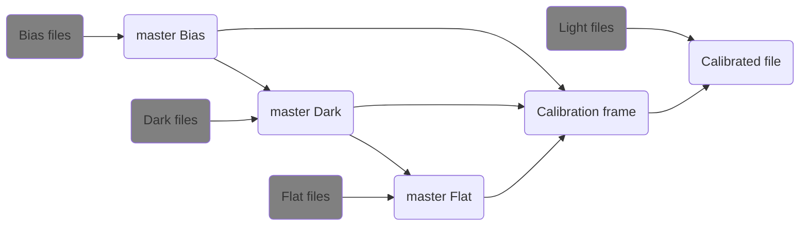
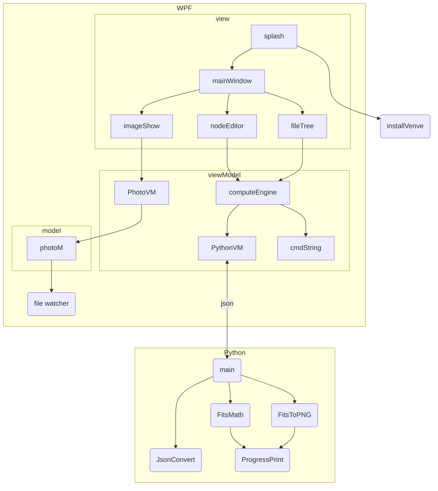

# Astro Photometry

Its a tool for
astronomers to calibrate the raw
telescope exposures, and tag locations
of all stars inside.

### Tool goals:

1. Reduce photometry noise and
   increase signal to noise ratio.
1. Resolve astronomical object's
   identity using standard catalogs.

## Calibration process:



## The files:

| file             | description                   |
| :--------------- | :---------------------------- |
| AstroPhotography | WPF project using MVVM        |
| Python           | All the python implementation |
| data_test        | fits files for testing        |

## General explanation using a graph:



## Python Side:

### packages used:

- astropy
- Numpy

### venv installation

<details>
  <summary>code:</summary>

```shell
$ python -m venv --system-site-packages .\venv
```

1. to start venv type:

```shell
$ &"./venv/Scripts/Activate.ps1"
```

2. to get out of venv type:

```shell
$ deactivate
```

3. if error in stating, type in admin cmd:

```shell
$ Set-ExecutionPolicy Unrestricted -Scope Process
```

</details>

### packages

<details>
  <summary>code:</summary>

- update:

```shell
$ python -m pip install --upgrade pip
```

- astropy:

```shell
$ python -m pip install --upgrade astropy[recommended]
```

- pillow:

```shell
$ python3 -m pip install --upgrade Pillow
```

- matplotlib:

```shell
$ pip install matplotlib
```

if its not installing type without the `python -m `

- static type checker - mypy (doesn't fully work because astropy don't have decelerations):

```shell
$ python -m pip install mypy
```

</details>

## reference

- Structure of FITS files: http://www.eso.org/sci/software/esomidas/doc/user/18NOV/vola/node111.html
- FITS File Handling with astropy in python: https://docs.astropy.org/en/stable/io/fits/index.html
- FITS File Format: https://www.stsci.edu/instruments/wfpc2/Wfpc2_dhb/intro_ch23.html
- mypy: https://mypy.readthedocs.io/en/stable/index.html
